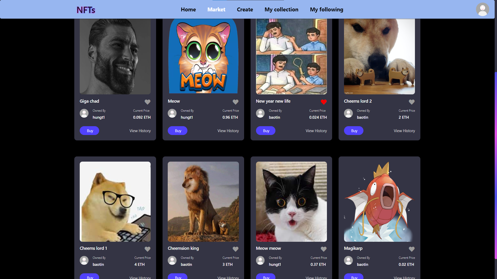

# NFT-marketplace

## About us
We will introduce briefly about our project:

+ This is our project for the **Introduction to Software Engineering** course @ HCMUS.
+ This repository contains the code for a simulated NFT marketplace website that is implemented using ReactJS for the front-end and Django for the back-end. The website allows users to simulate buying, selling, and transferring non-fungible tokens (NFTs).

### Contributors:

|   Student ID   |            Name               | Profile 
|----------------|-------------------------------|----------------------------
|    20120009    |Nguyen Van Hung | [@hungt1](https://github.com/hungt1)            
|    20120181    |Vo Van Tai | [@taivo202](https://github.com/taivo202)           
|    20120459    |Nguyen Van Dung | [@d2412916](https://github.com/d2412916)
|    20120596    |Nguyen Bao Tin | [@nbtin](https://github.com/nbtin)


## Features

The NFT marketplace website includes features such as user registration and login/logout, the ability for users to create, buy, sell, and follow NFTs, NFT ownership transfer between users with real-time wallet balance updates, and transaction history tracking.

## Technologies Used

The following technologies were used to implement the NFT marketplace website:
- Frontend: ReactJS.
- Backend: Django.
- Database management: SQLite3.

## Installation
To install and run the NFT marketplace website on localhost, follow these steps:
1. Clone the repository to your local machine:
```shell
git clone https://github.com/nbtin/NFT-marketplace
```
2. Navigate to the project directory:
```shell
cd NFT-marketplace
```
3. Install the required dependencies for both the frontend and backend:
```shell
pip install -r requirements.txt
cd frontend
npm i
```
4. Start the development server:
```shell
npm start
cd ../backend
python manage.py runserver
```
5. Open the website in your browser by navigating to http://localhost:3000/

*Please ensure that you have [**npm**](https://nodejs.org/en/download/) and [**Python**](https://www.python.org/downloads/) installed on your computer before proceeding.*


## Final Notes

**Thanks for going through this Repository! Have a nice day.**

Got any queries? Feel free to contact us via <a href = "mailto: baotin2402@gmail.com">E-mail</a>.